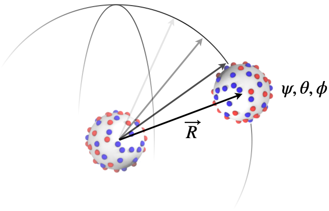

# Angular Scan

This iterates over all intermolecular poses between two rigid molecules.
For each pose, defined by two quaternions and a mass center separation, the
intermolecular interaction energy is calculated.

For each mass center separation, _r_, the partition function,
$Q(r) = \sum e^{-\beta u(r)}$, is explicitly
evaluated, whereby we can obtain the free energy, $w(r) = -kT \ln \langle e^{-\beta u(r)} \rangle$ and
the thermally averaged energy, $u(r) = \sum u(r)e^{-\beta u(r)} / Q$.

